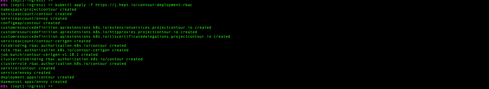

# Kubernetes "Demo": Improving App Secrets Config and Adding an Ingress

## Goals

* Recap & complete the namespace deployment for dev, qa, and prod todoapi environments, using the [Aug 13 writeup](https://github.com/us-learn-and-devops/2021_08_13) as reference (part 6)
* Secrets update:
  * Use a volume mount to consume the DB secrets
  * Ensure we're also creating our existing DB `secret`s securely
  * Use a docker-registry/image-pull `secret` to deploy `todoapi` via a private Docker registry
* Ingress:
  * Recap our options for configuring access to our deployed pods
  * Briefly discuss ingress controller/resource (in relation to service resources/types)
  * Install an ingress controller and ingress resource
  * Deploy a 2nd "echo" service to our k8s cluster
  * Update the ingress to give access to both backend serices

## Lab

### 1. Setup

Check out [the sept1demo](https://github.com/us-learn-and-devops/todoapi/tree/sept1demo) branch of the `todoapi` repo in us-learn-and-devops GitHub.

        git fetch --all
        git checkout sept1demo

Run the `/build/cluster-deploy.sh` script (or equivalent) to get your k8s cluster up and running.

To deploy a starting version of the `todoapi` to one or more of the environments (dev, qa, or prod), you'll need the DB username and password for the cloud MongoDB servers. Ping me on Zoom and I'll pass these along.

We'll be making the secrets setup more sophisticated as our first goal today. For a start, however, you'll need to feed these DB username and password values into e.g. <https://github.com/us-learn-and-devops/todoapi/blob/sept1demo/build/k8s/dev/secrets/dbusername> and <https://github.com/us-learn-and-devops/todoapi/blob/sept1demo/build/k8s/dev/secrets/dbpswd`> manually before you run `cd build/k8s && ./deploy.sh dev` to deploy `todoapi` to the dev environment.

Try hitting the dev `/list` endpoint once you get a URL back for the service's load balancer. Note that you may get a 502 error for about a minute or 2 until the load balancer is finished provisioning:

### 2. Use a volume mount to consume the DB secrets

That [sept1demo](https://github.com/us-learn-and-devops/todoapi/tree/sept1demo) branch of `todoapi` that you just deployed from is a couple commits ahead of where we were at last time.

What was added:

* A few changes to the underlying server code to swap out its dependency on DB-username/password environment variables for a dependency on reading the DB username and password from files within the local container file system: <https://github.com/us-learn-and-devops/todoapi/blob/sept1demo/configs/settings.go#L11-L12>.
  * This tedious code update is the reason I "fast-forwarded" our starting point and had you pull the project with this change already in place.
* The `deployment.yaml` file now contains a [volume](https://github.com/us-learn-and-devops/todoapi/blob/sept1demo/build/k8s/deployment.yaml#L53-L56) (which is a Docker volume local to the todoapi pod) that gets created from the DB secret we created [here](https://github.com/us-learn-and-devops/todoapi/blob/sept1demo/build/k8s/deploy.sh#L10).
* That volume gets mounted into our todoapi container file system [here](https://github.com/us-learn-and-devops/todoapi/blob/sept1demo/build/k8s/deployment.yaml#L39-L42), allowing the server code to read the values by reading those local files.

The big picture is that we haven't changed (yet) the way we create the DB secret, but we *have* changed the way we consume it.
This pulls our sensitive app secrets out of the environment variables and makes their usage a bit more secure, in line with k8s recommended practice.

Note: The subject of volumes in the k8s context is a larger issue that we'll expand on later, though not today.

### 3. Ensure we're also creating our existing DB `secret`s securely

Now let's also change the way we create the DB secret to support a more secure deployment model.
We'll do this in a couple of alternative ways:

#### Option 1: Continue to create the secret from files

* With your terminal cursor at the todoapi project root, move up one level to its parent directory and create another directory named "todoapi_secrets":

        pushd .. && mkdir todoapi_secrets

* Copy our dev, qa, and prod secrets files into this new location and then return:

        mkdir todoapi_secrets/{dev,qa,prod}
        mv todoapi/build/k8s/dev/secrets/ todoapi_secrets/dev/secrets/
        mv todoapi/build/k8s/qa/secrets/ todoapi_secrets/qa/secrets/
        mv todoapi/build/k8s/prod/secrets/ todoapi_secrets/prod/secrets/

* Create an environment variable that records the location of these moved files, then return:
  
        pushd todoapi_secrets
        export TODOAPI_SECRETS_PATH=$(pwd)
        popd && popd

* Modify the [deploy.sh file](https://github.com/us-learn-and-devops/todoapi/blob/sept1demo/build/k8s/deploy.sh#L10) to use the moved files to create your `todoapi-configs` secret:

        kubectl create secret generic todoapi-configs --from-file="${TODOAPI_SECRETS_PATH}/${ENV}/secrets" -n "${ENV}"

* Try running the deploy again. Note that k8s won't notice that you modified your secret-creation setup, so you'll have to delete the secret to force k8s to recreate it:

        kubectl delete secret todoapi-configs -n dev
        ./deploy.sh dev

#### Option 2: Create the secret from literal values

* Create a couple of local variables in your terminal session:

        export DB_USERNAME=<redacted>
        export DB_PSWD=<redacted>

* Modify the [deploy.sh file](https://github.com/us-learn-and-devops/todoapi/blob/sept1demo/build/k8s/deploy.sh#L10) to use these:

        kubectl create secret generic todoapi-configs --from-literal="dbusername=${DB_USERNAME}" --from-literal="dbpswd=${DB_PSWD}" -n "${ENV}"

  * Note that you MUST choose names ("dbusername" and "dbpswd") that correspond to the filenames your server code will expect to find mounted into its container filesystem by the `deployment.yaml`: <https://github.com/us-learn-and-devops/todoapi/blob/sept1demo/configs/settings.go#L11-L12>.

* Try running the deploy again:

        kubectl delete secret todoapi-configs -n dev
        ./deploy.sh dev

### 4. Use a docker-registry/image-pull `secret` to deploy `todoapi` via a private Docker registry

We've been pulling our `todoapi` Docker image from a public Docker Hub repository so far: <https://hub.docker.com/repository/docker/brandallk/gotodoapi>.

In real life, with real clients, you're much more likely to push and pull your images from a private repository.
I've created a private one here: <https://hub.docker.com/repository/docker/brandallk/gotodoapiprivate>.

The "latest" image tag from this repo will be the one we'll start using from now on.
To do that, we need to support Docker login credentials in our `deployment.yaml`.

See k8s docs [here](https://kubernetes.io/docs/tasks/configure-pod-container/pull-image-private-registry/).

Feel free to create your own private repo (using Docker Hub or any other Docker registry), then build the `todoapi` Dockerfile and push a "latest" tag image to your own repo.

You'll need to either know your own Docker login credentials or ping me on Zoom for the ones for <https://hub.docker.com/repository/docker/brandallk/gotodoapiprivate>.

Note that you can set up a credentials helper to make the login config more sophisticated.
To keep things simpler, we'll just use the username/password/email credentials like in [this](https://kubernetes.io/docs/tasks/configure-pod-container/pull-image-private-registry/#create-a-secret-by-providing-credentials-on-the-command-line) example.

* Create variables in your terminal session that you'll use in the next step to create the k8s secret:

        export DOCKER_SERVER="docker.io"
        export DOCKER_USERNAME=<redacted>
        export DOCKER_PSWD=<redacted>
        export DOCKER_EMAIL=<redacted>

* Add a couple lines to the [deploy.sh file](https://github.com/us-learn-and-devops/todoapi/blob/sept1demo/build/k8s/deploy.sh) somewhere above [line 18](https://github.com/us-learn-and-devops/todoapi/blob/sept1demo/build/k8s/deploy.sh#L18):

        # Deploy the `secret` that will hold the Docker-repository login creds
        # (Requires DOCKER_SERVER, DOCKER_USERNAME, DOCKER_PSWD, and DOCKER_PSWD env vars)
        kubectl create secret docker-registry dockerlogin --docker-server="${DOCKER_SERVER}" --docker-username="${DOCKER_USERNAME}" --docker-password="${DOCKER_PSWD}" --docker-email="${DOCKER_EMAIL}" -n "${ENV}"
        kubectl label secret dockerlogin app=todoapi -n "${ENV}"

* Update the deployment.yaml file to use this image-pull secret:

(Note that an image-pull secret can also be added to a k8s service account: <https://kubernetes.io/docs/tasks/configure-pod-container/configure-service-account/#add-imagepullsecrets-to-a-service-account>. This would be a more sophisticated way to ensure that your cluster users (especially automated users like pipeline agents/runners) can access your private image registry. If "service account" is a new term for you, that's likely because it's a k8s concept we haven't talked about yet.)

* Try running the deploy again:

         ./deploy.sh dev

  * (You can ignore the "error" from the `todoapi-configs` secret: These are telling you that k8s is refusing to alter the DB-creds secret because its config didn't change: That's exatly what we're expecting.)

### 5. Install an `ingress` controller and use it

We didn't have enough time today to cover the concept and details of `ingress` controllers and resources, so we'll follow up on that conceptual material next week.

In brief, adding an `ingress` resource to our `todoapi` will allow us to out-source control over access to our `todoapi` pods from requests coming in from the public internet to a component that is more versatile and, in real client situations with multiple services deployed to your cluster, also more efficient and cost-effective.

We will not get rid of the `service` resource that is currently being used to load-balance across our `todoapi` pods in each environment.
But we will change its type from `LoadBalancer` to `NodePort`. That's because the new `ingress` will be smart enough to take on the load-balancing role that our `service` resource has been doing up until now.
The `NodePort` service type still supports allowing access from a source external to the k8s cluster (like the public internet), but is too unwieldy to be used on its own unless you've got an intelligent automated component sitting in front of it that knows how to use a NodePort service on your behalf.
That's what our `ingress` will be doing.

We'll add an `ingress.yaml` file and deploy it for our `todoapi` service.
But first, we MUST install a plugin ingress controller on our k8s cluster itself: Creating an `ingress` resource on its own won't do us any good unless our cluster has an ingress controller that knows what to do with that `ingress` resource.

Your k8s cluster doesn't come with an ingress controller pre-installed: It's not part of the k8s core feature set.

Ingress controllers are one of the pluggable items that k8s leaves open to the cluster admin to select and install.

There are many options for ingress controller.
We could install an AWS Load Balancer Controller; other cloud-provider-specific controllers exist.
The Nginx ingress controller is a popular choice too.

Installing any of these controllers is a multi-step process and can be fairly complex.
Fortunately, they typically offer user-friendly config files you can download, modify, and use with kubectl or helm to deploy the controller so you don't have to do it all from scratch.

For simplicity, we're going to use an Envoy-based ingress controller called "Contour" because its really easy to install and it's not cloud-provider specific: <https://projectcontour.io/>.
(Envoy is a reverse-proxy server that is getting increasing use lately, especially after getting selected as the side-car used by the Istio service mesh.)

Installing the Contour ingress controller is a one-liner command if we stick with the default configuration (which we will, because it will work fine for our use case):

        kubectl apply -f https://j.hept.io/contour-deployment-rbac

This should only take a few seconds to finish. You'll note that it installs a number of resources for you en route to installing the controller:

You can check out the LoadBalancer service that Contour's controller makes available by running `kubectl get svc -n projectcontour`:

With that (or any other appropriate) ingress contoller installed on your k8s cluster, you can now define and deploy an `ingress` resource for `todoapi`.

* Create a file called `ingress.yaml` in the [/build/k8s](https://github.com/us-learn-and-devops/todoapi/tree/sept1demo/build/k8s) folder with the following contents:

        apiVersion: networking.k8s.io/v1
        kind: Ingress
        metadata:
            name: todoapi
            labels:
                app: todoapi
        spec:
            rules:
                - http:
                    paths:
                      - path: /
                          pathType: Prefix
                          backend:
                            service:
                                name: todoapi
                                port:
                                    number: 80

  * This has a list of "rules" defining how the ingress's load-balancer will route incoming requests to the backend service(s) pods. In this case, we only have one backend service, and we're specifying that any incoming request to the "/" endpoint or any endpoint beginning with "/" should be sent on to the k8s `service` pods for the service named "todoapi", listening on port 80.
  * We haven't yet configured a TLS cert for `todoapi`, so we're still listening on port 80 (http), not 443 (https).
  * (Note that if we had installed a different kind of ingress controller, the ingress resource manifest would probably be somewhat different: The exact content of these will tend to change depending on the ingress controller. You will typically need to add some annotations to the metadata.)

* Modify the [service.yaml file](https://github.com/us-learn-and-devops/todoapi/blob/sept1demo/build/k8s/service.yaml#L8) to specify a service of type `NodePort`:

* Add the `ingress.yaml` to your deploy.sh script below [line 18](https://github.com/us-learn-and-devops/todoapi/blob/sept1demo/build/k8s/deploy.sh#L18):

        # Deploy the `ingress` in this namespace
        kubectl apply -f ./ingress.yaml -n "${ENV}"

* Alter the [next-to-last line](https://github.com/us-learn-and-devops/todoapi/blob/sept1demo/build/k8s/deploy.sh#L25) in the `deploy.sh` script to report the ingress hostname for the new `ingress` rather than for the `service` resource:

* Try running the deploy again:

         ./deploy.sh dev

  * (You can ignore the "errors" from the dockerlogin and todoapi-configs secrets; these are expected and not a problem.)
  * Note that you'll probably get a warning about `extensions/v1beta1` being deprecated. You can ignore this. We're not using `extensions/v1beta1`, so we're already good to go re that deprecation.

* Check to make sure a request from the public internet still work OK. This is now going through the ingress to your NodePort service to your `todoapi` pods:

You can check out the current [master branch](https://github.com/us-learn-and-devops/todoapi/tree/master) of `todoapi`. I've updated it to reflect all the above changes.

In addition, it (temporarily) contains doubled deployments and services for the `todoapi` servers as a cheap way to simulate multiple backend servers, and a modified `ingress.yaml` with a 2nd [path rule](https://github.com/us-learn-and-devops/todoapi/blob/master/build/k8s/ingress.yaml#L18) that takes advantage of that to show off an ingress's capability to configure access to multiple backends.

(This is taking advantage of the fact that the `todoapi` contains a couple of `/echo` [routes](https://github.com/us-learn-and-devops/todoapi/blob/master/cmd/todo_api_server/handlers/routes.go#L13-L14) that behave differently from the other API routes, so we're pretending that we have a 2nd backend server that is an "echo" service, and routing all requests with `/echo` endpoints to that service instead of to the other `todoapi` service.)

We won't keep this feature permanently, but I'll leave it up for this week.

### 6. Clean up

Don't forget to [clean up](https://github.com/us-learn-and-devops/todoapi/blob/master/build/cluster-destroy.sh) your cluster for this week:

        cd .. && ./cluster-destroy.sh
